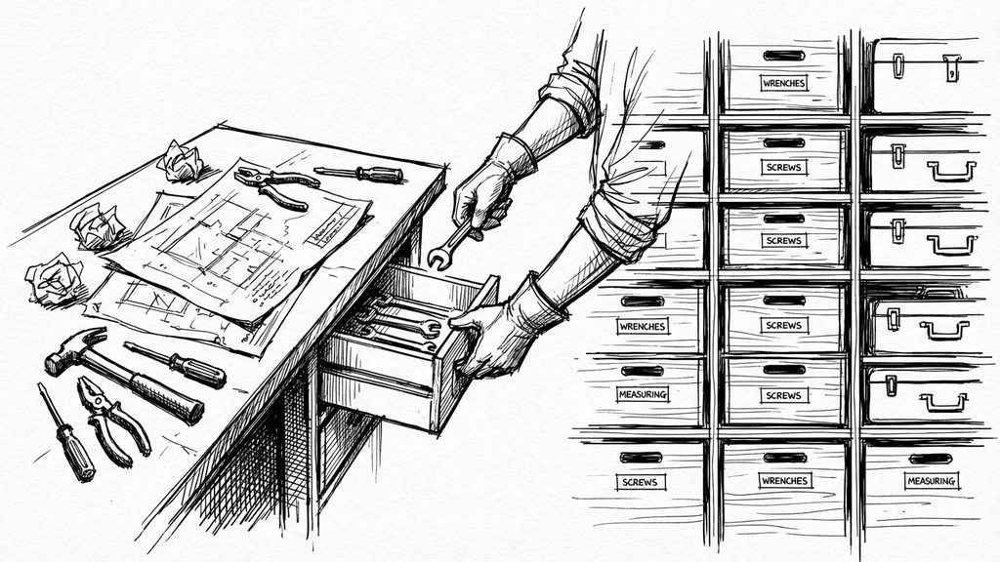
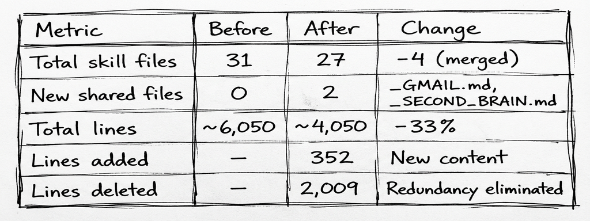
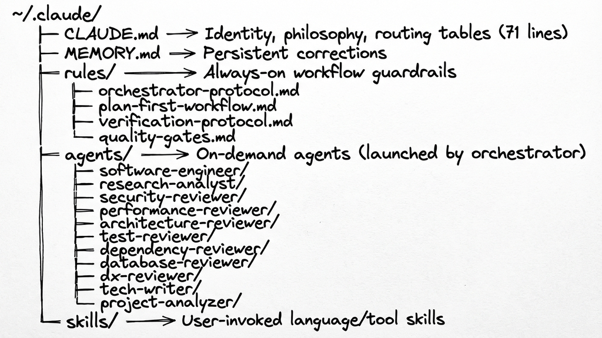
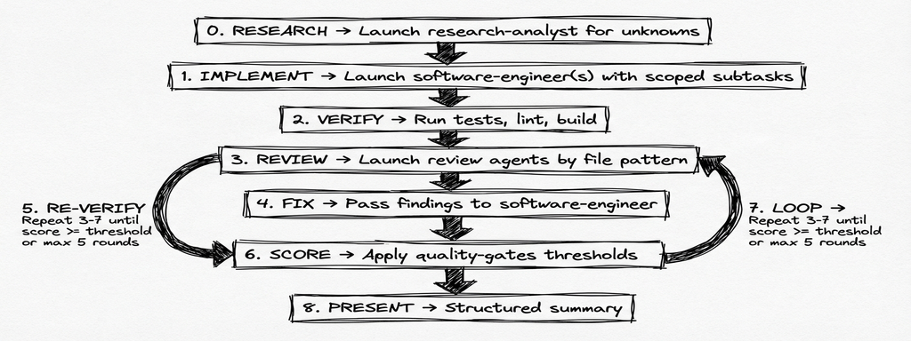
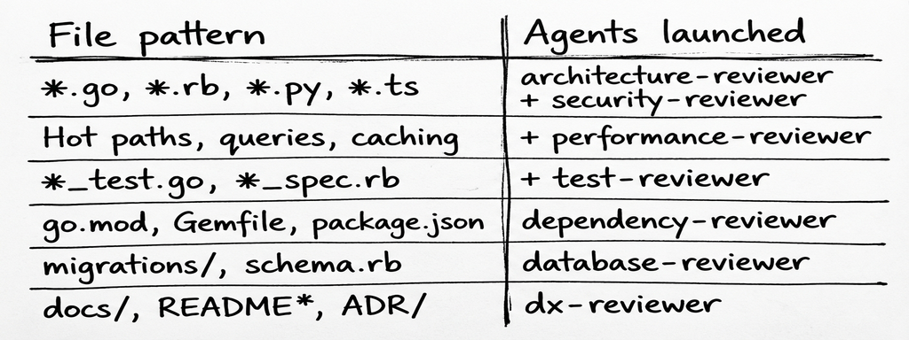

# When Your AI Skills Library Gets Too Smart for Its Own Context Window
## From Token Optimization to an Orchestrated Development Workflow with Claude Code

**Massimiliano Aroffo**
*8 min read*

---

A follow-up to my previous article on building modular AI skills for [Claude Code](https://docs.anthropic.com/en/docs/claude-code) (Anthropic's CLI tool for agentic coding), where I discovered that teaching an AI your patterns is only half the battle: the other half is fitting those patterns into a finite context window, and then making them *do something*.



*The final diff: 352 lines added, 2,009 deleted. Sometimes the best code you write is the code you delete.*

## Part 1: The Bloat Problem

In my [previous article](https://medium.com/@maroffo), I described building [claude-forge](https://github.com/maroffo/claude-forge): a modular skills library that teaches Claude Code your development patterns. The repo symlinks into `~/.claude/` (Claude Code's config directory), so everything loads automatically. Go idioms, Python conventions, Rails architecture, Terraform modules: each encoded in a token-optimized markdown file that auto-loads based on project context.

It worked great. Too great, actually.

The collection grew from 9 skills to 27. The original 5,761 lines expanded to over 7,000 as I added Android/Kotlin, React/Next.js, Apple/Swift, cloud infrastructure, ClickUp integration, Gmail workflows, and iOS sub-skills borrowed from [Harper Reed's dotfiles](https://github.com/harperreed/dotfiles/tree/master/.claude).

**The thing I built to solve a problem had become the problem.**

Skills were eating tokens like a teenager at an all-you-can-eat buffet. The Go skill alone was 299 lines. The `_INDEX.md` was 238 lines of routing tables and "How to Use" sections that Claude didn't need because it already knows how to read an index. The Gmail configuration appeared identically in five email skills. The ast-grep patterns were copy-pasted into every language skill.

Every duplicated line is a stolen token. Every stolen token is context that could have been used for actual thinking.

## The Optimization Strategy

I asked Claude to optimize its own skill files: identify duplication across all 27 skills, find content redundant with its system prompt or [MCP](https://modelcontextprotocol.io/) (Model Context Protocol) tool schemas, compress verbose sections, and merge skills that should never have been separate. The key insight: I explicitly asked Claude to find content redundant with *its own system prompt*. I can't see the full system prompt, but Claude knows what it receives and can identify when a skill file is repeating free information.

Claude Code's `Task` tool launches lightweight subagent processes that run in parallel, each scoped to a specific job. I used these to analyze skill clusters simultaneously: one on the Swift family, another on email workflows, a third on language skills. Each returned a duplication report. Then I executed a phased optimization:

- **Swift mega-merge**: 5 iOS skills (`apple-swift`, `swift-concurrency`, `swiftui-performance`, `swiftui-refactor`, `native-app-performance`) shared the same `@available` boilerplate and were just different facets of "Apple platform development." Four deleted files, zero lost functionality.
- **Shared references**: Gmail config duplicated in 5 email skills. Extracted to `_GMAIL.md` (33 lines) and `_SECOND_BRAIN.md` (52 lines), eliminating ~200 lines of duplication. DRY principle, applied to AI instructions.
- **Stripping known content**: The ClickUp skill had 70 lines of MCP tool parameter tables that Claude already receives via its system prompt. Replaced with one line. The `project-analyzer` went from 396 to 90 lines. The `commit/` skill (59 lines) merged into `source-control/`.
- **Compound cleanup**: ast-grep patterns deduplicated across every language skill. Ruby's 31-line HTTP client example compressed to one architectural decision. `_INDEX.md` from 238 to 49 lines.

That last point deserves illustration. Here's a real before/after from the Ruby skill:

**Before** (31 lines):
```ruby
module MyGem
  class Client
    def initialize(base_url:, token:, timeout: 10)
      @uri = URI.parse(base_url)
      @token, @timeout = token, timeout
    end
    def get(path)
      request = Net::HTTP::Get.new(path)
      execute(request)
    end
    private
    def execute(request)
      request["Authorization"] = "Bearer #{@token}"
      # ... 15 more lines of Net::HTTP setup
    end
  end
end
```

**After** (1 line):
```
HTTP: Net::HTTP + JSON.parse, set use_ssl/open_timeout/read_timeout.
Auth via request["Authorization"]. Client class: initialize(base_url:,
token:, timeout:) + private execute.
```

Same architectural decision. One-thirtieth the tokens. Claude knows the Ruby stdlib; it needs your *convention*, not a tutorial.

### The Numbers



**Nothing was lost.** Every pattern, convention, and workflow is still there: compressed, deduplicated, or deleted because Claude already knew it.

---

## Part 2: From Skills to an Orchestrated Workflow

The optimization left me with a lean skills library. But it exposed a fundamental limitation: **skills are passive**. They load knowledge into context. They don't *do* anything with it. Nothing tells Claude *how to behave* across a development session: when to plan, when to test, when to review, when to stop and score the work.

Inspired by [Pedro Santanna's orchestrated academic workflow](https://github.com/pedrohcgs/claude-code-my-workflow), I adapted his three-tier architecture (Rules, Agents, Skills) for software engineering. Think of it as a virtual engineering team:

- **Rules** are the engineering manager: always-on process guardrails that define when to plan, test, review, and score.
- **Agents** are the specialists: on-demand experts for implementation and review, launched by the orchestrator.
- **Skills** are the team wiki: the passive knowledge base that agents draw from.
- **MEMORY.md** is the team's shared notebook: corrections and lessons that persist across sessions.

The **orchestrator** is the protocol that makes these layers work together. Here's the full picture:



Let's walk through each layer and how it plugs into the orchestration.

### Rules: The Always-On Layer

Rules are the backbone of the orchestrator: they define *how* Claude behaves across an entire development session. They auto-load every conversation, replacing process content that was bloating `CLAUDE.md`.

The **orchestrator protocol** defines the autonomous development loop:



The **plan-first workflow** saves plans to disk (plans in context evaporate during auto-compression). The **verification protocol** formalizes TDD as an always-on rule. The **quality gates** create numeric thresholds: 80/100 to commit, 90/100 to open a PR. A CRITICAL finding auto-fails to 0.

### Agents: The On-Demand Specialists

Rules define the loop; agents are the workers inside it. Steps 1 and 4 (IMPLEMENT, FIX) use the software-engineer agent. Step 3 (REVIEW) launches specialized reviewers. The orchestrator picks which agents to launch **based on which files changed**, not manually selected:



All review agents are **read-only**: they report findings with severity rankings, file locations, and proposed fixes, but never edit code. This forces separation of concerns: finding problems is separate from fixing them. A reviewer that can "fix" things bypasses your approval loop; it might "fix" a security issue by deleting the test that caught it. Read-only agents can't break your code. They can only make you think harder about it.

### The Software Engineer Agent

The software-engineer is the only agent that writes code. It handles Step 1 (IMPLEMENT) and Step 4 (FIX) of the orchestrator loop. My first instinct was to split it into `backend-engineer` and `frontend-engineer`. I talked myself out of it. The real dimension isn't technology stack, it's **independence of the workstream**:

- "Add auth middleware + rate limiting": both backend, but independent workstreams
- "Refactor package ordering + package catalog": both backend, parallelizable
- "Migrate endpoint from REST to gRPC": backend, but not parallelizable

A single `software-engineer` agent gets configured per-task with **scope** (files it owns), **plan** (subtask + criteria), and **context** (language/framework). For full-stack features, the orchestrator launches multiple instances in parallel, each scoped to its workstream. Each agent commits incrementally after each coherent unit of work (no mega-commits), and each commit must pass tests independently.

The critical design decision: **reviewer findings are requirements, not suggestions**. CRITICAL and MAJOR findings must be addressed. The engineer can deviate from the proposed fix if it has a better solution, but it must explain why.

### MEMORY.md and Knowledge Persistence

The orchestrator loop runs within a single session. But what about learning *across* sessions? `MEMORY.md` holds one-line corrections that persist:

```
[LEARN:docker] Alpine needs musl, not glibc: use bookworm-slim
[LEARN:postgres] pgx v5 uses pgxpool, not pgx.Connect directly
```

Think of `LEARNING.md` (full retrospectives via the `learning-docs` skill) as your engineering journal. `MEMORY.md` is your sticky notes. And `CLAUDE.md`, freed from process instructions that now live in rules, became what it should have been all along: **identity and philosophy** (under 80 lines).

---

## Part 3: Stealing Selectively

Before publishing, I analyzed [Every's compound-engineering-plugin](https://github.com/EveryInc/compound-engineering-plugin): 29 agents, 25 commands, 16 skills. The largest Claude Code configuration I've seen. Three architectural patterns survived the audit:

**1. The Solutions Directory**

Their `compound-docs` system documents solved problems in `docs/solutions/[category]/`. Most knowledge capture is either too heavy (full retrospectives) or too light (one-line notes). A categorized directory of solved problems hits the sweet spot. The agents create and search this structure in the *target project*, not in claude-forge. Each project accumulates its own searchable knowledge base.

**2. The Research Agent**

Our workflow was all implementation and review, no structured research step. The new `research-analyst` agent slots in as Step 0: before implementation, when there are unknowns. It searches internal knowledge first (`docs/solutions/`, `LEARNING.md`, `MEMORY.md`), then external sources. Key constraint: **opinionated, not neutral.** It picks a winner and explains why.

**3. Incremental Commits**

Their work command makes logical commits after each subtask, not one mega-commit at the end. Now the software-engineer agent commits after each coherent unit: one endpoint, one component, one migration. Each commit must pass tests independently.

We rejected their file-based todos (we have ClickUp), swarm mode (coordination overhead > throughput past 3 agents), persona-based reviewers ("What would DHH think?" is fun but unreliable), and plugin marketplace format (we optimize for one tool, done well). Out of 29 agents and 25 commands, three architectural patterns were worth adopting. The other 26 are token tax.

---

## Part 4: The Annotation Cycle, or How to Stop Wasting Implementation Rounds

The orchestrator loop was working. But on complex tasks (new integrations, cross-cutting refactors, unfamiliar tech), I kept hitting the same pattern: Claude would produce a solid plan, I'd approve it, implementation would start, and three files in I'd realize the plan had a wrong assumption baked into its foundation. Revert. Re-plan. Re-implement. Tokens burned, time wasted.

The insight came from [Boris Tane's workflow](https://boristane.com/blog/how-i-use-claude-code/), where he annotates plan documents inline with terse corrections ("not optional", "use drizzle:generate", "remove this section") and iterates 1-6 times before any code gets written. The idea is simple: **the plan is a shared mutable document, not a proposal you accept or reject.**

But Boris applies this to *every* task. That's overhead I don't want on a three-file bugfix. The question became: when does the annotation cycle pay for itself?

### Adaptive Complexity

The answer was already in the system. The research-analyst (Step 0 of the orchestrator) already evaluates unknowns before planning. It just wasn't classifying them. Now it ends every research report with a complexity verdict:

- **simple/moderate**: standard flow (plan → approve → implement)
- **complex**: extended flow (plan → annotate → iterate → approve → implement)

The criteria are concrete: unfamiliar tech, more than 5 files, multiple valid approaches, no prior art in `docs/solutions/`, cross-cutting concerns. Not a gut feeling: a checklist.

### What Changes for Complex Tasks

Two things happen that don't happen for simpler work:

**1. The research artifact persists.** Instead of research findings living only in context (where they evaporate during auto-compression), the research-analyst writes them to `quality_reports/research/`. On a complex task, losing research context mid-implementation is how you end up with an agent that contradicts its own earlier analysis.

**2. The plan enters an annotation loop.** I open the plan file, add inline notes where I see problems ("this table already exists", "use the existing auth middleware, don't create a new one", "priority order is wrong here"), and Claude addresses every annotation without implementing. One to four rounds, usually. By the time I type "approved", the plan has been pressure-tested against my knowledge of the codebase. The cost of those annotation rounds is tiny compared to the cost of reverting a wrong implementation.

The key design decision: **the research-analyst decides, not the developer.** I don't want to manually classify complexity for every task, and I'd be biased toward "just ship it" anyway. The agent has already done the research; it knows whether there's prior art, how many files are involved, whether the tech is well-understood. Let the informed party make the call.

For simple tasks, nothing changes. The overhead is zero. For complex tasks, the overhead is 5-15 minutes of annotation, which prevents hours of wasted implementation. The system got smarter about when to be careful, and that's the whole game.

---

## The Bigger Picture

Six months into this experiment, the skills library has evolved from a flat collection of markdown files into a three-tier system with orchestrated agents, quality gates, and persistent memory:

1. **Skills**: teach Claude your patterns (passive knowledge)
2. **Optimization**: compress to fit the context window (same knowledge, fewer tokens)
3. **Rules**: define always-on behavior (active process)
4. **Agents**: specialized reviewers and implementers (active delegation)
5. **Orchestrator**: autonomous development loop (active workflow)
6. **Knowledge compounding**: solutions directory, research agent, incremental commits (active learning)
7. **Adaptive depth**: complexity-aware research and annotation cycles (active calibration)
8. **Periodic re-evaluation**: ask the model to audit its own instructions as capabilities evolve (active maintenance)

Each step built on the previous. You can't orchestrate bloated skills (step 2 enables step 5). You can't route agents without rules (step 3 enables step 4). And step 8 loops back to step 2: as models improve, yesterday's essential guidance becomes today's redundant tokens, and the cycle restarts.

### The Engineering Principles

**The three-tier separation is the single most important architectural insight.** The manager (rules), the specialists (agents), and the wiki (skills) each have a clear boundary. Before, everything was either in CLAUDE.md (bloated, always loaded, mixing identity with process) or in skills (passive, knowledge-only). Separating *process* from *knowledge* from *execution* is what made orchestration possible.

**Your skills should contain the delta, not the baseline.** Don't document what the AI already knows. The test: "Would a senior developer who knows this language need this information to follow our conventions?" If yes, keep it. If it's just teaching the language, cut it.

**Let the AI optimize itself, but verify.** Claude finds duplication patterns across files that humans miss because we don't hold 30+ files in memory simultaneously. But in one case, it flagged a "contradictory" architecture recommendation (MVVM vs MV in Swift) that was actually intentional: MVVM for UIKit legacy, MV for modern SwiftUI.

**Your instructions are coupled to model capabilities, and capabilities move fast.** When I first wrote the Go skill on Sonnet 4.5, those 299 lines of idiomatic patterns were genuinely useful: the model needed explicit guidance on error handling conventions, interface design, mechanical sympathy. Months later, when I asked Opus 4.6 to optimize the same skills, it told me it already knew most of those patterns and suggested cutting them. The skill that was essential for one model was token tax for its successor. This isn't a one-time optimization: it's a recurring practice. Every few months (or when you upgrade models), ask the model to audit its own instruction set: "What here is redundant with your training? What do you still need?" Treat your AI like a team member who's been taking courses: periodically check what they've learned and stop explaining things they already know.

**Signal per token is what matters.** Not having less, but having more value per token. I added Go mechanical sympathy patterns (5 new concepts) and reduced the Go skill from 410 to 189 lines in the same pass. The token count is lower than when I started with 9 skills, despite covering over 10 languages, 11 agents, 4 rules, and half a dozen productivity workflows.

**Treat your AI instructions with the same engineering rigor you apply to your code.** Refactor. Deduplicate. Compress. Architect. Iterate. And accept that what you wrote today may be obsolete in three months, not because it was wrong, but because the model caught up.

Your context window will thank you. And then it will start writing your code.

---

**The complete system is at [github.com/maroffo/claude-forge](https://github.com/maroffo/claude-forge). Key commits: [496aa4d](https://github.com/maroffo/claude-forge/commit/496aa4d) (optimization: +352/-2,009), [599572c](https://github.com/maroffo/claude-forge/commit/599572c) (orchestrated workflow: +766), [da51731](https://github.com/maroffo/claude-forge/commit/da51731) (final token optimization: +53/-189). The compound-engineering-inspired additions (research agent, solutions directory, incremental commits) came last.**

*Thanks to [Mauro Medda](https://github.com/mauromedda), [Federico Scanu](https://www.linkedin.com/in/federicoscanu), and [Luca Bonetti](https://www.linkedin.com/in/lb-luca-bonetti/) for the ideas, inspiration, and review.*

---

*Massimiliano Aroffo is a Cloud Engineer and Architect at Wishew, where he builds infrastructure automation and occasionally uses AI to optimize AI instructions about AI that orchestrate other AI. The turtles are getting recursive.*

*Fun fact: every image in this article (cover, tables, diagrams) was generated by Claude Code using two skills from the very system described here (`cover-image` and `table-image`). The skills invoke a shared Python script that calls Gemini's image generation API. I typed `/cover-image`, described the article, Claude crafted a visual metaphor, and the forge forged its own illustrations. Then `/table-image` turned every markdown table into a hand-drawn sketch. Turtles all the way down.*
