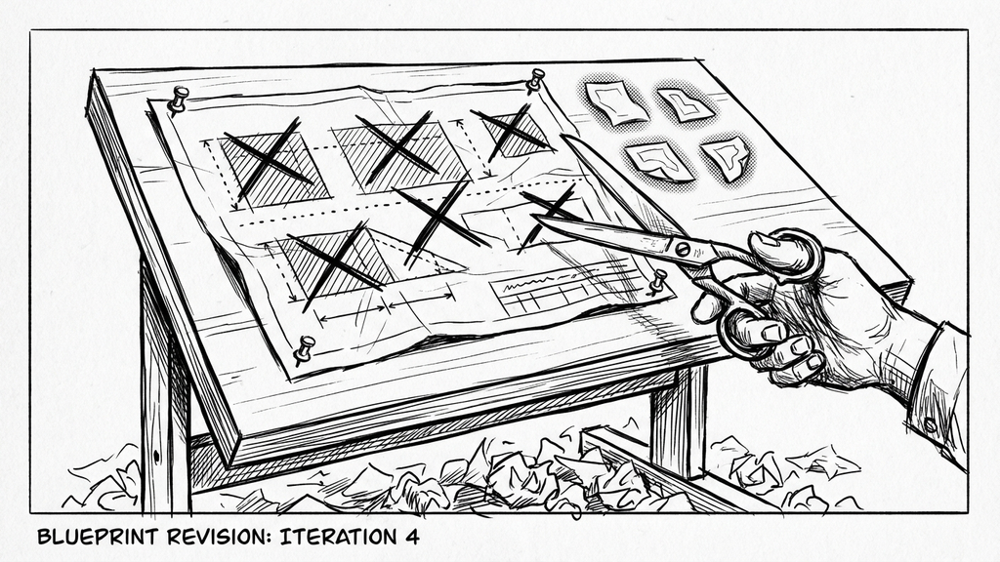
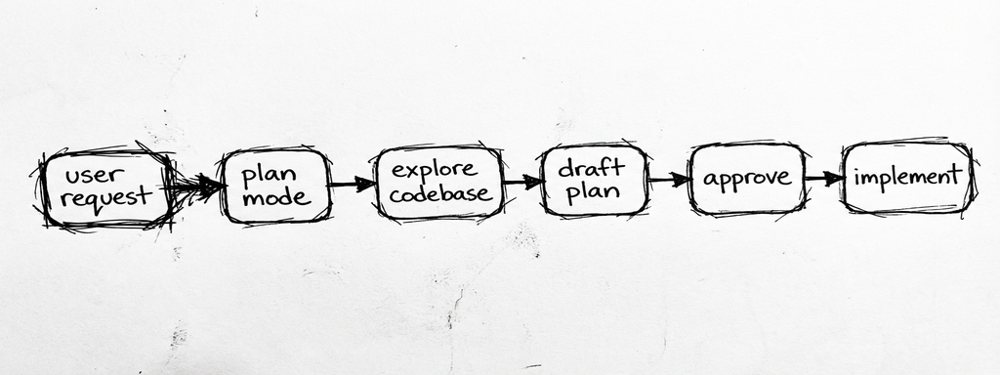
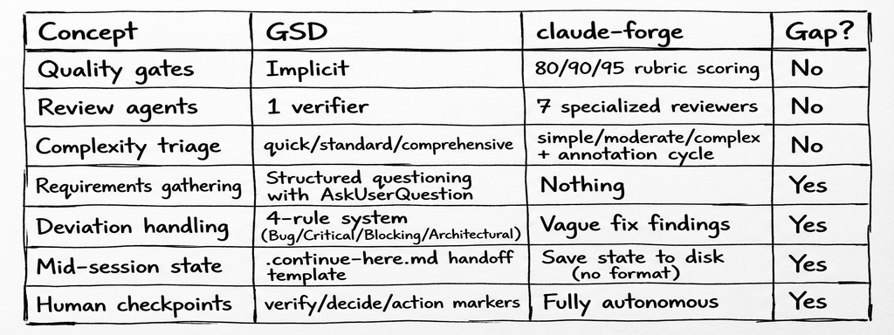
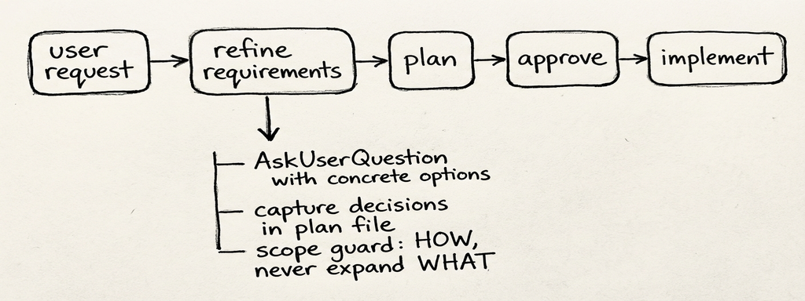
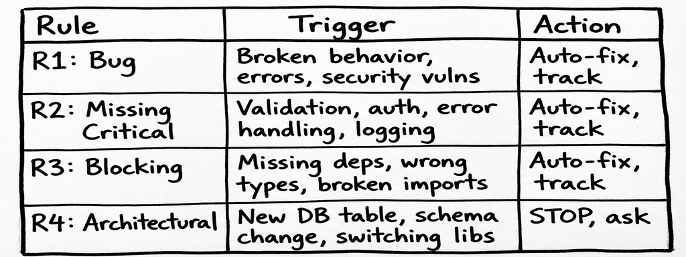
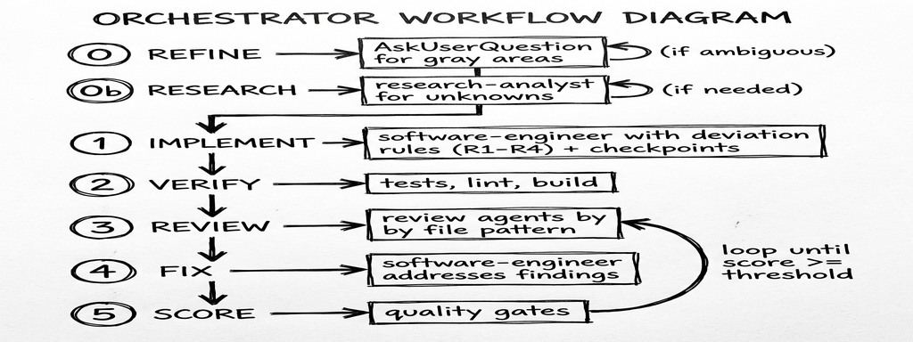

# The Missing Step: What a Colleague's Hint Taught Me About AI-Driven Planning
## Structured Requirements, Deviation Rules, and the Art of Selective Theft

**Massimiliano Aroffo**
*8 min read*

---

A follow-up to my previous articles on building [claude-forge](https://github.com/maroffo/claude-forge): a modular skills and orchestration system for [Claude Code](https://docs.anthropic.com/en/docs/claude-code). This time, a colleague pointed at someone else's system and said five words that reshaped how the whole thing works.



*Five concepts borrowed. Twenty rejected. Sometimes the best feature is the one you don't build.*

## The Hint

My colleague (let's call him the Pointy Haired Boss, for reasons he'll appreciate) had been looking at [Get Shit Done](https://github.com/gsd-build/get-shit-done), a popular meta-prompting system for Claude Code. His observation was specific: "The thing where GSD really excels is the initial requirements gathering using `AskUserQuestion`. You could use something like that too, to refine requirements before building the execution plan."

Five words that mattered: *before building the execution plan.*

I'd built an orchestrator that plans, implements, reviews, scores. It handles complexity classification, parallel agents, quality gates. But it had a blind spot I'd never noticed: **it jumped straight from the user's request to the plan, without stopping to ask what the user actually meant.**

## The Blind Spot

Here's what our workflow looked like before:



User says "add authentication." The orchestrator enters plan mode, explores the codebase, and drafts a plan. The plan picks JWT because the codebase already has a JSON API. Sensible default. I approve. Implementation starts.

Three files in, I realize I wanted session-based auth because this is a server-rendered app with HTMX. The JWT assumption was baked into the plan's foundation. Revert. Re-plan. Re-implement.

The plan wasn't wrong. It was *uninformed*. Nobody asked: "JWT or sessions? OAuth too? What about password reset? 2FA?"

GSD asks those questions. Before any planning happens, it runs a structured questioning flow that identifies gray areas, presents concrete options via `AskUserQuestion`, and captures decisions. The planner never has to guess.

PHB didn't say "adopt GSD." He pointed at one specific thing it does well. That's the kind of feedback that's actually useful.

## What GSD Does (and What It Doesn't)

Before borrowing anything, I spent a few hours reading GSD's source: 50+ markdown files across commands, workflows, agents, templates, and references. A thorough system, clearly born from real frustration with AI inconsistency.

The comparison was instructive:



Five gaps. Everything else was either already covered or not worth the token cost. GSD's XML task format, model profiles, progress bars, STATE.md living document, project initialization ceremony: all interesting, none solving problems we actually have. We're developers who use plan mode, not vibecoding a product description into existence.

The principle from [Part 3 of the previous article](https://medium.com/@maroffo) applied again: out of a large system, a handful of architectural patterns are worth adopting. The rest is token tax.

## What We Borrowed

### 1. Requirements Refinement (the PHB insight)

The biggest change. Before drafting a plan, the workflow now identifies gray areas in the request and clarifies them with structured questions.

The key design decisions, borrowed from GSD's `questioning.md` and `discuss-phase` workflow, then compressed to fit our token budget:

**Concrete options, not open-ended questions.** "Which auth method?" with three specific choices is faster and more useful than "How do you want to handle authentication?" The `AskUserQuestion` tool presents options the user can react to, including "You decide" when Claude's discretion is fine.

**Follow the thread.** Each answer may open the next question. "OK, JWT. What about refresh tokens? Silent rotation or explicit refresh endpoint?" The system follows energy, not a checklist.

**Scope discipline.** If the user suggests something new during refinement ("should we also add social login?"), capture it as a deferred idea and redirect. "That sounds like a separate task. Noted. Back to token rotation."

**Skip when unnecessary.** Single-file changes, specific instructions, trivial fixes: no refinement needed. The overhead is zero for simple tasks.

Here's what the plan-first workflow looks like now:



The decisions feed directly into a `## Decisions` section in the plan file. The software-engineer agent reads them and never has to guess whether you meant JWT or sessions.

**The trigger problem.** The first version of this change was passive guidance: "before drafting a plan, identify and resolve ambiguities." Correct instruction. But Claude in plan mode has its own default behavior (explore codebase, draft plan), and the "skip when requirements are already specific" clause gave it an easy out. The refinement step might simply not fire.

GSD doesn't have this problem because questioning *is* the command (`/gsd:discuss-phase`). It's not an optional step before another step.

The fix was a dual guarantee: the rule became **MANDATORY** ("Do NOT draft a plan with unresolved ambiguities"), and a dedicated `/refine-requirements` skill provides an explicit trigger for when you want to force it. The rule covers the automatic case; the skill covers the "I know this needs refinement" case.

This is a general lesson for AI instruction design: passive guidance gets skipped under pressure. Mandatory instructions with explicit skip conditions are more reliable. And having an explicit invocation as backup catches the cases where even "MANDATORY" doesn't stick.

**Token cost:** ~25 lines in the plan-first-workflow rule + a 27-line skill.

### 2. Deviation Rules for the Software Engineer

Our software-engineer agent had vague guidance: "fix reviewer findings" and "flag assumptions." But what happens when, mid-implementation, it discovers the database migration is missing a column? Or that the auth middleware doesn't exist yet? Or that the chosen library doesn't support the required feature?

GSD's executor has a 4-rule deviation system that maps cleanly to our existing decision framework (auto/propose/ask), but applies it *during implementation* rather than at planning time:



The heuristic is simple: does this affect correctness, security, or the ability to complete the task? Rules 1-3, fix it. Does it change the system's structure? Rule 4, stop and present options.

The critical addition: all deviations get tracked in the Implementation Report. No silent fixes. If the engineer auto-fixed a missing database index (R2) or worked around a broken import (R3), it's documented. The review agents see what happened.

**Before:**
```markdown
### Assumptions Made
- Assumed JWT for auth
```

**After:**
```markdown
### Deviations from Plan
- [Rule 2 - Missing Critical] Added rate limiting to /api/auth — not in plan but endpoint was unprotected
- [Rule 3 - Blocking] Fixed missing bcrypt dependency — package.json didn't include it
(or "None — plan executed as written")
```

**Token cost:** ~20 lines added to the software-engineer agent.

### 3. Context Preservation with `.continue-here.md`

Our plan-first workflow had one line about context preservation: "Rely on auto-compression. Save state to disk before context gets large."

Correct advice. Zero guidance on *how*.

GSD's `.continue-here.md` template is practical: current state, completed work, remaining work, decisions made (with *why*), and a specific next action. It's a handoff document, not a permanent artifact. You delete it after resuming.

The "decisions made with WHY" part is the real value. Without it, a fresh session might re-debate a choice that was already settled. With it, the next session starts with: "We chose connection pooling over per-request connections because the Lambda has a 30-second timeout, and cold connections take 2 seconds each."

We adopted the template format, stripped the GSD-specific tooling (no `gsd-tools.js` for us), and embedded it directly in the plan-first workflow rule.

**Token cost:** ~15 lines replacing the single vague line.

### 4. Checkpoint Markers in Plans

Our plans assumed fully autonomous execution: the software-engineer runs from start to finish, review agents check the work after. This works for most tasks. It doesn't work when the plan includes "deploy to staging" or "verify the UI renders correctly" or "confirm the OAuth redirect works."

GSD has an elaborate checkpoint protocol with three types (human-verify, decision, human-action), continuation agents, and structured return formats. We took the concept and compressed it to two markers:

```markdown
<!-- checkpoint:verify -->   → STOP, show what was built, user verifies
<!-- checkpoint:decide -->   → STOP, present options, user picks
```

Between checkpoints, execution is autonomous. The software-engineer knows to stop when it hits a marker. 0-2 per plan, used sparingly. This isn't about adding gates, it's about acknowledging that some moments genuinely need human eyes.

**Token cost:** ~10 lines across the plan-first workflow and orchestrator protocol.

### 5. Goal-Backward UAT (the late addition)

This one came later. A different colleague, Andrea, pointed out that GSD's `/gsd:verify-work` phase was something we'd missed entirely.

Our quality gates verify that *code* is good: tests pass, lint clean, review agents find no critical issues. Score 80+, commit. Score 90+, PR. But none of that answers: "does the feature actually work?" A search endpoint can have 100% test coverage and still return results in the wrong format because the tests were written against the same wrong assumption as the code.

GSD's UAT is elaborate: it derives "must-be-true" observable behaviors from the original goal (goal-backward), walks through them conversationally, and spawns debug agents with hypothesis-driven investigation when something fails. Full state tracking, persistent UAT files, the works.

We took the core idea and compressed it. After the orchestrator presents results (step 8), it now derives 3-7 must-be-true behaviors from the original goal and walks through them one at a time with `AskUserQuestion`. Pass, fail, or skip. On failure, the existing fix loop handles diagnosis and repair, then re-UATs only the failed items.

The critical design choice: **when to skip.** UAT adds overhead, and not every change has user-facing behavior. Docs-only changes, config, pure refactors, single-function fixes with passing tests: skip it. Everything else: run it. When in doubt, run it.

**Token cost:** ~13 lines in the orchestrator protocol, no new files. The fix loop already existed; UAT just feeds it user-reported failures instead of only review-agent findings.

## What We Didn't Borrow

The selective part matters as much as the theft.

**STATE.md (living project state file).** GSD maintains a <100 line file that every workflow reads first: current position, progress bar, velocity metrics, accumulated decisions, session continuity. It's well-designed. It's also maintenance overhead. Our session logs and MEMORY.md already cover cross-session knowledge. Adding a file that must be read and updated by every workflow is a token tax on every invocation, and for single-session work (most of what we do) it's pure overhead.

**XML task format.** GSD structures plans as XML with `<task type="auto">`, `<verify>`, `<done>` tags. Optimized for Claude's parser, sure. But our markdown plans with approval work fine, and adding XML formatting rules is complexity without demonstrated benefit for our workflow.

**Model profiles (quality/balanced/budget).** GSD lets you configure which model (Opus/Sonnet/Haiku) each agent uses. Our orchestrator routes agents by task and file pattern. The model selection is a platform concern, not a workflow concern.

**Project initialization ceremony.** GSD's `new-project` is a 300+ line workflow: deep questioning, parallel research agents, requirements extraction, roadmap creation. Built for "I have an idea, build it." We're experienced developers who know what we want, we just need to clarify the ambiguous parts. The requirements refinement step is our version: targeted, not ceremonial.

**Progress bars and velocity tracking.** Visual progress indicators and "average duration per plan" metrics. Fun to look at, low signal for how we work. Our quality scores (80/90/95) tell us whether the work is good enough to commit/PR/ship, which is the only metric that matters.

Six concepts rejected. In each case, the reasoning was the same: either we already had an equivalent, or the token cost exceeded the value. The context window is finite; every line of instruction competes with actual code for space.

## The Compound Effect

These five changes are small individually. Requirements refinement is ~25 lines in the rule plus a 27-line skill. Deviation rules are ~20 lines. Context preservation is ~15 lines. Checkpoints are ~10 lines. UAT is ~13 lines. About 115 lines total, spread across four files.

But they close a loop. Before: the orchestrator could plan, implement, review, and score, but it couldn't *ask the right questions* before planning, couldn't *handle surprises* during implementation, couldn't *preserve state* when pausing, couldn't *stop for human judgment* when it mattered, and couldn't *verify the result actually works* from the user's perspective.

The workflow now looks like this:



Each borrowed concept addresses a different failure mode:
- Requirements refinement prevents **wrong assumptions** in the plan
- Deviation rules prevent **silent workarounds** during implementation
- Context preservation prevents **lost state** across sessions
- Checkpoints prevent **unverified outcomes** in human-dependent steps
- UAT prevents **false confidence** when tests pass but the feature doesn't work

None of these are revolutionary ideas. They're table stakes in human engineering processes. The insight, the one PHB triggered, was that our AI workflow was missing them.

## The Principle

Three articles in, a pattern emerges in how this system evolves: someone points at something, I read the source, I take 10-20% of it, and I compress it to fit our token budget. The compound-engineering-plugin gave us the research agent and solutions directory. Boris Tane gave us the annotation cycle. GSD gave us requirements refinement, deviation rules, and goal-backward UAT.

The instinct is always to adopt the whole system. The discipline is to ask: "Which specific problem does this solve that we actually have?" and then write the minimum lines to solve it.

PHB said five words. Andrea said three ("what about UAT?"). They turned into 115 lines of markdown and one new skill. The plans are better now, and the results get verified.

---

**The updated system is at [github.com/maroffo/claude-forge](https://github.com/maroffo/claude-forge). Key changes: requirements refinement in `rules/plan-first-workflow.md` and `skills/refine-requirements/`, deviation rules in `agents/software-engineer/AGENT.md`, checkpoint and UAT support in `rules/orchestrator-protocol.md`.**

*Thanks to the Pointy Haired Boss for the hint that started this, to Andrea for the UAT nudge that finished it, and to TACHES (GSD's creator) for building a system worth reading carefully.*

---

*Massimiliano Aroffo is a Cloud Engineer and Architect at Wishew, where he builds infrastructure automation and has now written three articles about optimizing the AI system that helps him build infrastructure automation. The recursion is becoming a feature.*
