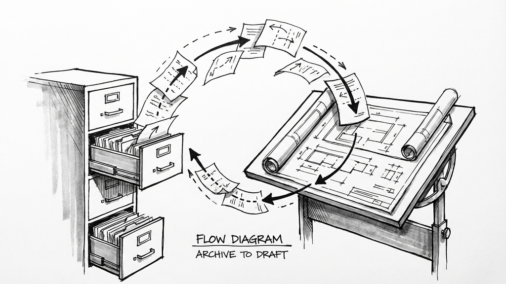
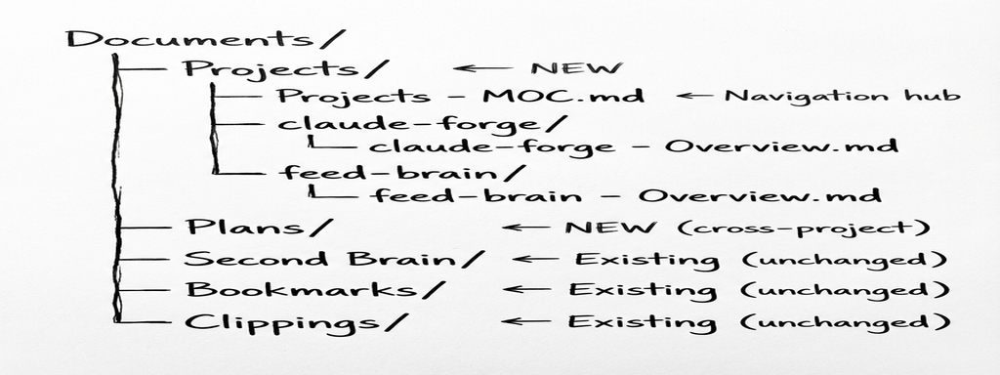
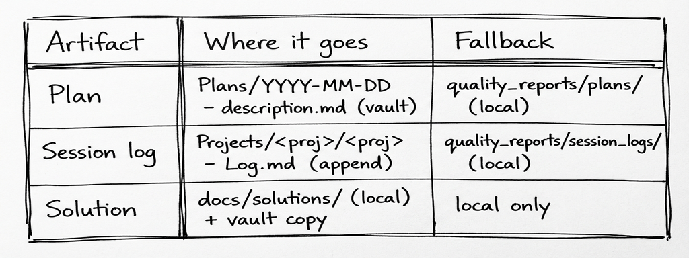
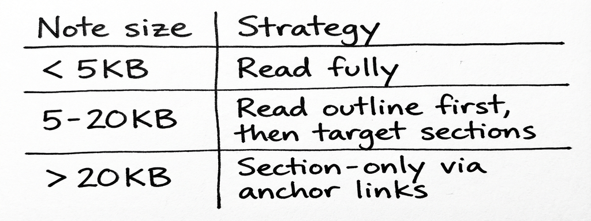
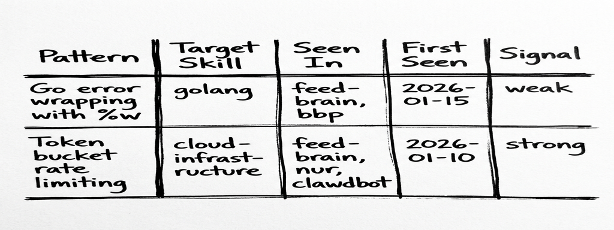
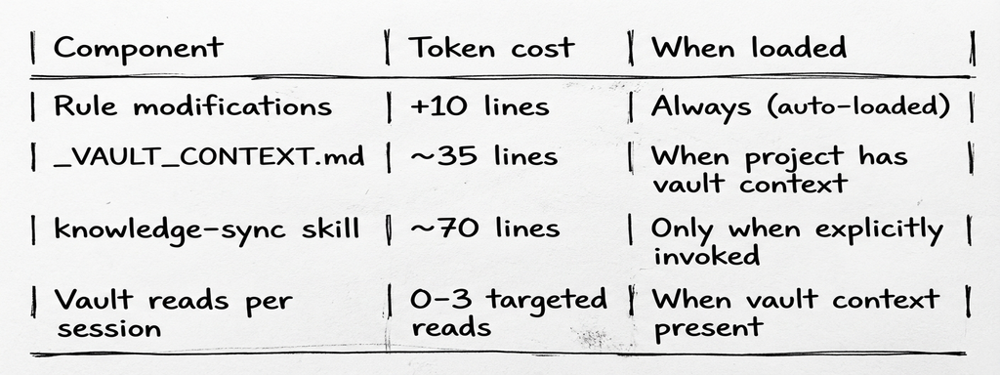

# When Your AI's Second Brain Starts Talking Back
## Three Layers of Knowledge Integration Between Obsidian and Claude Code

**Massimiliano Aroffo**
*10 min read*

---

Part four in a series on building [claude-forge](https://github.com/maroffo/claude-forge): a modular skills and orchestration system for [Claude Code](https://docs.anthropic.com/en/docs/claude-code). This time, the system stops forgetting what it already knows.



*A Second Brain that only stores. Skills that only instruct. The bridge between them was missing.*

## Two Systems, One Gap

I had an Obsidian vault with 12 topic files, bookmarks, clippings, and three skills that could push content into it. Newsletter arrives, `/newsletter-digest` processes it, the vault grows. Bookmark saved from email, `/process-email-bookmarks` routes it. The vault was a *write-only* store from Claude's perspective: things went in, nothing came back out.

On the other side, I had skills. Markdown files that teach Claude how to write Go, manage infrastructure, review code. Static knowledge, manually updated. When I solved a Redis maxmemory problem in three different projects over six months, the solution lived in `docs/solutions/` of the project where I last fixed it. The other two projects had no idea.

The vault knew things the skills didn't. The skills taught patterns the vault couldn't reference. Session logs, when they existed, lived in `quality_reports/` directories that nobody looked at. Plans lived in local folders that died with the project.

The knowledge was there. It was just scattered across three disconnected systems: vault (Obsidian), skills (claude-forge), and project-local artifacts (quality_reports/).

## The Architecture: Three Layers

The fix isn't one feature, it's three layers that build on each other. Each layer is useful alone, but the compound effect comes from all three working together.

### Layer 1: The Vault as Structured Storage

The Obsidian vault already had a structure: `Second Brain/` for topic files, `Bookmarks/` for links, `Clippings/` for saved articles. What it didn't have was a place for *project artifacts*, the things Claude produces during work: plans, session logs, solutions.



**Two design decisions matter here.**

First: `Plans/` is separate from `Projects/` because plans can span multiple repos and have a different lifecycle (draft, annotated, approved, done). A plan for "migrate auth to OAuth across three services" doesn't belong in any single project folder.

Second: session logs are NOT separate files. Each project gets a single `<project> - Log.md` with dated entries, like a timeline. Same for solutions. One file that grows, not a folder of files nobody navigates.

The artifact flow is straightforward:



The fallback matters. If Obsidian isn't running, or the CLI isn't available, everything still works through the local paths that existed before. The vault is the preferred destination, not the only one.

**The rule changes are minimal.** The plan-first workflow's step 3 went from `Save to quality_reports/plans/` to `obsidian create ... (fallback: quality_reports/plans/)`. Session logging went from `Append to quality_reports/session_logs/` to `obsidian append ... (fallback: quality_reports/session_logs/)`. The orchestrator gained a step 9 (STORE) after PRESENT. Six lines changed across two rule files.

Solutions get a dual-write: the local copy stays (the research-analyst searches `docs/solutions/` internally), but a summary also goes to the vault for cross-project discovery. When you're working on project B and the research-analyst searches the vault, it finds the Redis fix from project A.

**Project onboarding is automated.** You don't manually create vault notes for each project. Say "onboard this project to the vault" and Claude reads the project's CLAUDE.md, creates Overview/Log/Solutions notes, registers in the Projects MOC, and adds `## Vault Context` to the CLAUDE.md. The same thing happens automatically when running `/project-analyzer` on a new codebase. One sentence, four artifacts.

### Layer 2: The Vault as Context Source

Layer 1 puts things *into* the vault. Layer 2 pulls things *out*.

Project CLAUDE.md files can now include a `## Vault Context` section with wikilinks to vault notes:

```markdown
## Vault Context
<!-- Follow these links via `obsidian read` for deeper context -->
- Architecture: [[Projects/feed-brain/feed-brain - Overview]]
- Decisions: [[Projects/feed-brain/feed-brain - Log#Decisions]]
- Solved problems: [[Projects/feed-brain/feed-brain - Solutions]]
- Go patterns: [[Second Brain - Development#Go (Golang)]]
```

When Claude starts a session and encounters this section, it can read the linked notes via `obsidian read` for context that's richer than what fits in CLAUDE.md itself. The project overview might be 20 lines in CLAUDE.md but the vault note has the full architecture, deployment topology, and historical decisions.

**Token budget is the constraint.** Reading the entire vault into context would be absurd. Three rules keep it practical:



The `## Vault Context` section uses 3-7 links max per project. Section anchors (`#Section`) target large notes. Claude reads on demand, not eagerly at session start.

**Breadcrumbs.** During a session, when Claude discovers something non-obvious (a gotcha, a configuration detail, a workaround), it can append an HTML comment to the relevant vault note:

```
<!-- breadcrumb: 2026-02-14 | Redis maxmemory-policy must be volatile-lru for webhook queues -->
```

Invisible in Obsidian's preview mode, but readable by future Claude sessions. A lightweight way to accumulate institutional knowledge without cluttering the notes.

### Layer 3: The Feedback Loop

This is where it gets interesting. Layers 1 and 2 move knowledge between the vault and Claude sessions. Layer 3 moves knowledge from the vault *into the skills themselves*.

The problem: you solve the same kind of issue across multiple projects. Go error wrapping with `%w`. Token bucket rate limiting. Redis connection pooling. Each time, you (or Claude) rediscover the pattern, implement it, maybe write a solution file. But the *skill*, the file that teaches Claude how to write Go or manage infrastructure, never learns.

**The annotation schema.** Second Brain topic notes get a `## Skill Candidates` section:



Table-based (not YAML frontmatter) because: easy to append via CLI, readable in Obsidian, parseable by Claude, no frontmatter corruption risk.

**Signal strength.** Not every pattern deserves to be in a skill file. The signal system prevents noise:

- **weak**: seen in 1 project or 1 source. Track it, don't propose it.
- **strong**: 3+ projects OR 2+ independent sources. Propose to human.
- **applied**: already synced to the target skill. Skip.

Annotations happen during `learning-docs` retrospectives only. When a lesson learned maps to a skill domain, it gets appended to the relevant Second Brain file's table with signal `weak`. The threshold prevents premature promotion.

**The knowledge-sync process.** A new `/knowledge-sync` skill (invoked monthly or after milestones) runs a scan-filter-group-propose-approve-apply cycle:

1. Search vault for all `## Skill Candidates` tables
2. Filter to `strong` signals only
3. Group candidates by target skill
4. Draft exact text additions for each skill file
5. Present proposals to human (always RED in the decision framework, always requires approval)
6. On approval: edit skill, add vault backlink, update signal to `applied`

The human gate is non-negotiable. Skills are loaded into every session's context window. A bad addition costs tokens on every invocation forever. This is the one place where the system explicitly refuses to be autonomous.

## What We Didn't Change (and Why)

**MEMORY.md stays in `~/.claude/`.** It auto-loads every session because of its filesystem location. Moving it to the vault would mean an extra read step on every invocation. The auto-load is non-negotiable.

**`.continue-here.md` stays project-local.** It's a handoff document for the current working directory, not a vault artifact. It gets deleted after resuming. Putting it in the vault would add complexity without benefit.

**The Obsidian CLI reference didn't change.** `_OBSIDIAN.md` was already complete. The `obsidian/` skill gained one new workflow (project onboarding), but no new CLI commands were needed.

**Local fallbacks are mandatory.** Every vault operation has a local equivalent. If Obsidian isn't running, the system degrades gracefully to `quality_reports/` paths. The vault is preferred, not required.

## Bonus: The Skills Got Better Too

While building the vault integration, a parallel question kept coming up: are the skills themselves well-structured? If knowledge-sync is going to propose additions to skill files, those files better be solid.

Anthropic published a [Complete Guide to Building Skills for Claude](https://www.anthropic.com/engineering/claude-code-best-practices): 33 pages of best practices for the very thing claude-forge is built on. We audited all 28 skills against it. The results were humbling.

**Two skills were broken.** `ios-debugger` and `swiftui-liquid-glass` had no YAML frontmatter at all: Claude couldn't even match them to user requests. They existed in the skills directory, invisible to the routing system.

**Eleven skills had weak descriptions.** The description field is what Claude uses to decide *when* to load a skill. "Go development conventions" doesn't tell Claude that you want this skill when someone says "how do I handle goroutine errors." Adding trigger phrases ("Use when working with .go files, go.mod, or user asks about goroutines, channels, error handling, interfaces") made the difference between a skill that activates and one that sits there.

**Six overlapping skills had no disambiguation.** `rails` and `ruby` both match Ruby-related requests. Without negative triggers ("Not for Rails apps, use rails skill" in the ruby description), Claude had to guess. Same for `source-control` vs `commit`, and the three email-processing skills.

**Three skills were too large.** `apple-swift` at 383 lines, `android-kotlin` at 321, `rails` at 238. Anthropic's guide recommends progressive disclosure: keep SKILL.md under ~150 lines with core patterns, move detailed content to a `references/` subdirectory that Claude reads on demand. We split all three.

We touched 37 files to fix this, but the meta-lesson led to something more lasting: a `/skill-forge` skill that encodes both Anthropic's guide and our conventions as a validation checklist. Creating a new skill? `skill-forge create <name>` walks through the template. Auditing existing ones? `skill-forge review all` scores every skill on structure, description quality, content specificity, and conventions. Score 90+ ships, 70-89 needs fixes, below 70 is a rewrite.

This matters for the feedback loop. Layer 3 proposes additions to skills. If those skills are poorly structured, the additions land in the wrong place or get lost in noise. Clean skills make the whole pipeline more reliable.

## The Compound Effect

Here's what happens when all three layers work together.

**Day 1:** You solve a Redis connection pooling issue in feed-brain. The solution goes to `docs/solutions/infrastructure/` locally and to `feed-brain - Solutions.md` in the vault. The session log goes to `feed-brain - Log.md`.

**Day 15:** Working on a different project, the research-analyst searches the vault before planning. It finds the Redis solution from feed-brain. You don't re-solve it.

**Day 30:** During a learning-docs retrospective, the Redis pattern gets annotated as a skill candidate in `Second Brain - DevOps and Cloud.md`. Signal: weak (1 project).

**Day 60:** The same pattern shows up in a third project. The annotation gets updated: signal strong.

**Day 90:** You run `/knowledge-sync`. It finds the strong signal, drafts an addition to the `cloud-infrastructure` skill, and proposes it. You approve. The skill now teaches the pattern to every future session, in every project, automatically.

From accidental discovery to institutionalized knowledge in 90 days, with a human gate at every promotion step.

## The Token Budget

A reasonable concern: does this add token overhead to every session?



The always-on cost is 10 lines across two rules. Everything else is conditional: vault context only loads when a project declares it, knowledge-sync only loads when you invoke it. For projects without vault integration, the overhead is effectively zero.

## The Principle

Four articles in, the system's evolution follows a consistent pattern: each iteration adds a layer that makes the previous layers more valuable.

Skills alone were useful but static. The orchestrator made skills more useful by routing them intelligently. Requirements refinement made plans more accurate. The vault turns accumulated experience into skill improvements. And the skills guide alignment makes the skills themselves better containers for that accumulated knowledge.

The key insight: **knowledge compounds when it has structure.** An unstructured pile of solution files is searchable but not actionable. A signal-tracked table of patterns that feeds into a human-gated promotion workflow turns "we solved this before" into "the system knows how to solve this." And a quality checklist for the skills themselves ensures the destination is worth writing to.

The recursion from the previous article's bio line? It's now three levels deep. The system that helps build infrastructure has developed infrastructure for improving itself, and then used an external guide to improve the infrastructure of the infrastructure.

---

**The updated system is at [github.com/maroffo/claude-forge](https://github.com/maroffo/claude-forge). Key changes: vault storage in `rules/plan-first-workflow.md` and `rules/orchestrator-protocol.md`, context injection and project onboarding in `skills/_VAULT_CONTEXT.md`, knowledge sync in `skills/knowledge-sync/`, skill quality in `skills/skill-forge/`.**

---

*Massimiliano Aroffo is a Cloud Engineer and Architect at Wishew, where he builds infrastructure automation with an AI system that now has a memory, opinions about what it's learned, and a process for turning those opinions into institutional knowledge. The recursion has become self-reinforcing.*
